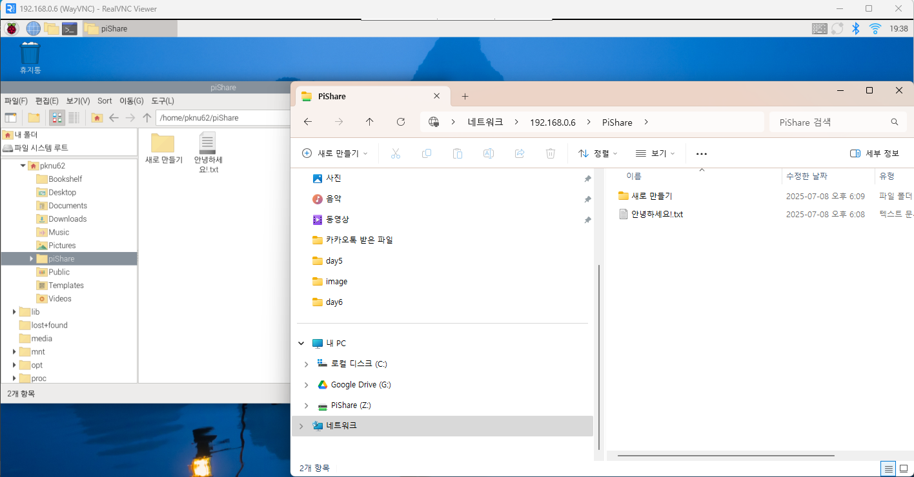
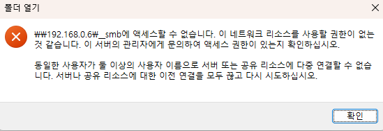
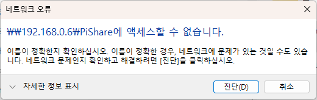
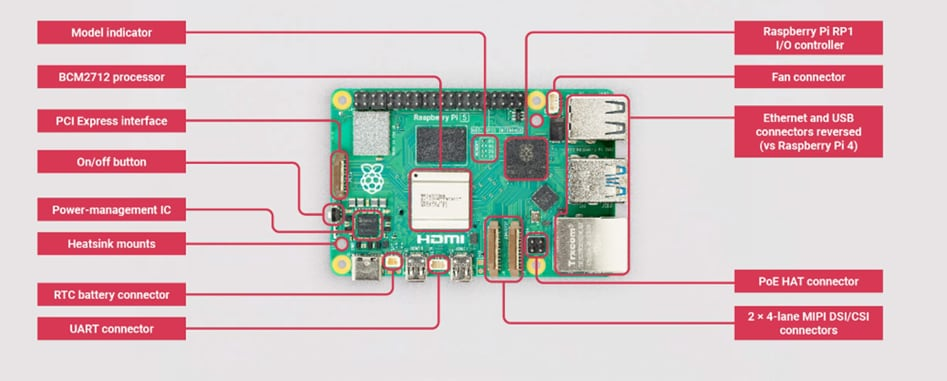
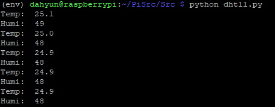
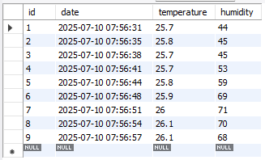
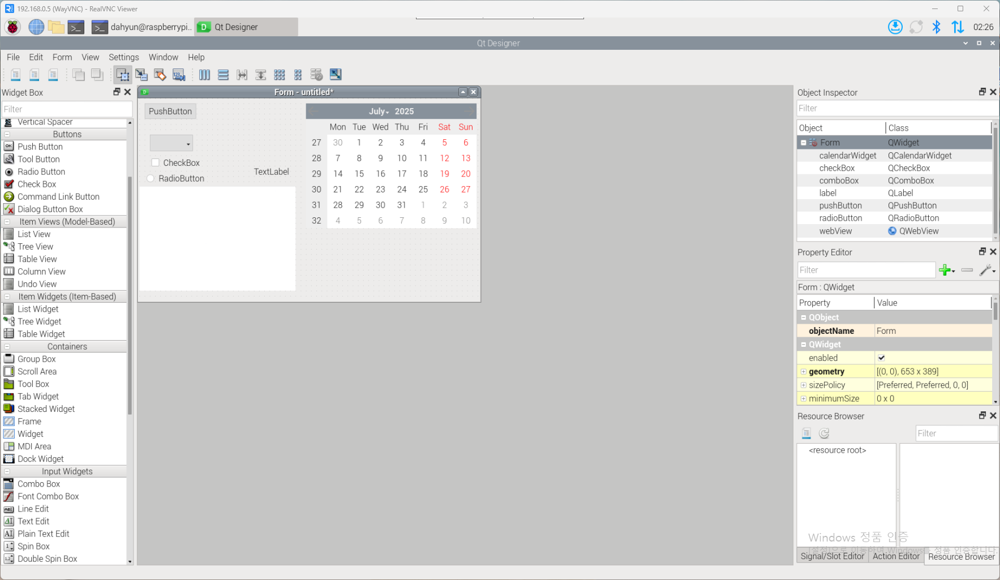
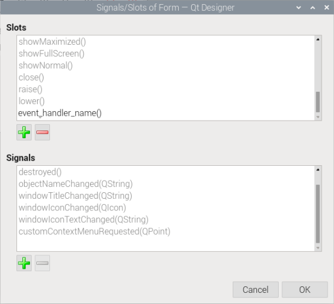
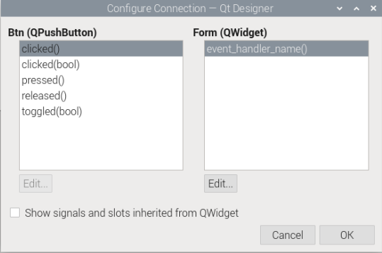

# Raspberrypi_Study
라즈베리파이 관련 내용 정리
## 1일차 
### 라즈베리 파이 환경설정
- [vnc 설치](https://www.realvnc.com/en/connect/download/viewer/?lai_vid=MM1063K0RcJA&lai_sr=0-4&lai_sl=l)
- [sdcard format](https://www.sdcard.org/downloads/formatter/)
- [라즈베리파이 os](https://www.raspberrypi.com/software/)
#### 무선 와이파이 설정
라즈베리파이 OS 를 설치할 때 자동으로 공유기 주소를 잡아내지 못했다. 
무선으로 연결해주기 위해 아래와 같은 설정을 했다.
1. 모니터와 키보드, 마우스 라즈베리파이에 연결
2. 터미널 창을 열어 `wpa_supplicant.conf` 파일 수정
```
sudo nano /etc/wpa_supplicant/wpa_supplicant.conf
```
```
country=KR
ctrl_interface=DIR=/var/run/wpa_supplicant GROUP=netdev
update_config=1

network={
    ssid="네트워크ID"
    psk="비밀번호"
    key_mgmt=WPA-PSK
}
```

3. Wi-Fi 서비스 재시작
```
sudo wpa_cli reconfigure
```
또는
```
sudo systemctl restart dhcpcd
```
4. 연결 상태 확인
```
iwgetid
```
```
ifconfig wlan0
```

#### GUI환경 - VNC 설정
1. 아래의 명령어로 설정 창 열기
```bash
> sudo raspi-config
```
2. Interface Options → VNC → <Yes> 메뉴 이동

3. `The VNC server is enabled` 메시지가 나오면 성공

4. `sudo reboot` 명령 입력, 종료 후 재부팅

**`vncserver-virtual`** 명령을 이용한 가상 데스크탑 생성
- 회색화면만 나오는 문제 발생
- 나중에 다시 시도해볼 것!

#### 한글 설정
언어 한글 선택시에 한글 폰트가 없어서 깨지는 현상 발생

한글 폰트 설치로 깨짐 해결
```bash
sudo apt update
sudo apt install fonts-nanum
```

#### 한글 입력기 설정
한글 폰트를 설치하더라도 기본적으로 한글 입력이 되지 않는다.
별도로 한글 입력기를 설치해주는 과정이 필요하다.
1. 터미널에서 아래의 명령어를 통해 입력기 설치
```
sudo apt install fcitx-hangul
```

2. 메뉴에서 "Fcitx 설정" 또는 "입력기 설정" 실행
    - 기본 입력기를 fcitx로 바꿔주기

3. Input Method 항목에서:
    - + 버튼 클릭
    - Korean - Hangul 추가

4. 환경변수 설정
```
`nano ~/.xprofile`
```
편집기에 아래의 내용 추가
```
export GTK_IM_MODULE=fcitx
export QT_IM_MODULE=fcitx
export XMODIFIERS="@im=fcitx"
```
**📌한글 입력이 바로 안 되면 재부팅 또는 로그아웃 → 로그인 해보기**
#### 라즈베리파이 공유폴더 사용
1. samba 설치
```
sudo apt update
sudo apt install samba
```
2. 계정생성 (시스템 사용자와 동일한 계정이어야 함)
```
sudo smbpasswd -a {사용자명}
```
- Smba 사용자 목록 확인 방법: `sudo pdbedit -L`
3. 공유할 폴더 생성
```
mkdir -p /home/pknu62/piShare
```
```
sudo chown -R pknu62:pknu62 /home/pknu62/piShare
sudo chmod -R 777 /home/pknu62/piShare  # 테스트용
```
> 📌 실제 운영 시엔 777 대신 755나 770 등 적절한 권한 설정하기!
4. `/etc/samba/smb.conf` 파일 수정
```ini
[PiShare]
    path = /home/pknu62/piShare
    valid users = pknu62
    browseable = yes
    writable = yes              # 또는 read only = no
    create mask = 0777
    directory mask = 0777
    public = no                 # 보안상 yes 보단 no 권장
    guest ok = no               # 게스트 접근 비활성화
```
5. Samba 서비스 재시작
```
sudo systemctl restart smbd
```
6. win + R `\\192.168.0.x` 입력
Win + R → \\192.168.0.x 입력

인증창이 뜨면:

- 사용자명: `pknu62`
- 비밀번호: `smbpasswd` 명령으로 설정한 비번

7. 공유 폴더 생성 완료

- ⚠️ 접근 오류가 생기면:
    - 윈도우 방화벽: 파일 및 프린터 공유 허용 상태 확인
    - 폴더 권한: `sudo chmod -R 777 /home/pknu62/piShare` 등도 필요할 수 있음



🔴 에러사항
1. 동일 사용자 접속


- 해결방법
    - 기존 SMB 연결 끊기 (Windows에서) `net use * /delete`

2. 폴더경로 맞지 않음

- 해결방법
    - `nano /etc/samba/smb.conf` 에 적은 폴더경로와 실제 파일경로 확인
    - 홈디렉토리 경로: `/home/{사용자명}`


## 2일차
### 라즈베리파이 구조



### 직렬과 병렬 연결
#### 직렬연결
- 전류가 하나의 경로만 따라 흐르는 연결 방식
- 특징
    - 전류는 모든 소자에 동일하게 흐름
    - 전체 전압은 각 소자에 분배
    - 저항은 모두 더해짐
- LED 3개를 직렬으로 연결할 경우 마지막 LED는 전압 부족으로 불이 약할 수 있음


#### 병렬 연결
- 전류가 여러 갈래로 나뉘어 흐를 수 있는 연결 방식
- 특징
    - 전압은 모든 소자에 동일하게 걸림
    - 전체 전류는 갈래마다 나뉘어 흐름
    - 저항
- LED 두 개를 병렬로 연결하면, 각 LED는 같은 전압을 받고 밝기 차이가 없음

### RPi.GPIO
라즈베리파이의 GPIO 핀을 제어하는 파이썬 라이브러리
**주요 함수**
```
GPIO.setmode()      # 핀 번호 체계 설정
    - GPIO.BCM      # GPIO 이름 기준
    - GPIO.BOARD    # 핀 위치 기준

GPIO.setup(pin, mode)   # 사용할 핀의 모드 설정(IN/OUT)
GPIO.output(pin, state) # HIGH(1) / LOW(0)
GPIO.input(pin)         # 입력 핀에서 값 읽기
GPIO.cleanup()          # 설정 초기화(중복 실행 방지)
```
**기본 사용 흐름**
```
import RPi.GPIO as GPIO
GPIO.setmode(GPIO.BCM)             # 핀 번호 모드 설정
GPIO.setup(17, GPIO.OUT)           # GPIO17 핀을 출력으로 설정
GPIO.output(17, GPIO.HIGH)         # GPIO17 핀에 3.3V 출력 → LED 켜짐
GPIO.cleanup()                     # 사용한 GPIO 핀 초기화
```

### 입력 회로 안정화 기법: Pull-up과 Pull-down
입력 핀(GPIO)은 입력이 "없을 때" 상태가 애매모호해지는 경우가 있다(플로팅 상태)
전압이 1 OR 0 이 아닌 떠 있는 상태 -> 노이즈나 오작동 발생
이것을 방지하기 위해 기본값을 강제로 0 또는 1로 고정해주는 안정화 기법이다.
#### 풀 업(Pull-up) 저항
- 기본 상태를 HIGH(1) 로 유지하고 싶을 때 사용
- 회로를 끊었을 때 입력이 자동으로 1이 되도록 함
#### 풀 다운(Pull-down) 저항
- 기본 상태를 LOW(0) 로 유지하고 싶을 때 사용
- 회로를 끊었을 때 입력이 자동으로 0이 되도록 함

라즈베리파이에서는 내장 풀업/풀다운 저항 기능을 소프트웨어로 설정이 가능하다.
```
GPIO.setup(pin, GPIO.IN, pull_up_down=GPIO.PUD_UP)
GPIO.setup(pin, GPIO.IN, pull_up_down=GPIO.PUD_DOWN)
```
---

### 공부하면서 들었던 의문 🤔
#### 1. 저항기능을 어떻게 소프트웨어로 설정가능할까?
소프트웨어로 설정하는 풀업 저항은 실제 라즈베리파이 내부 회로에 있는 **"내장 저항"**을 키는 것이다.

라즈베리파이의 GPIO 핀 안쪽 회로에는 내부 회로가 이미 내장되어 있다.
```
        3.3V
         |
    [내장 Pull-up 저항] ← 소프트웨어로 on/off
         |
GPIO PIN ●────────────→ 입력 신호 읽음
         |
    [내장 Pull-down 저항] ← 이것도 소프트웨어로 설정 가능
         |
        GND
```
물리적으로 풀업/풀다운 저항이 존재하지만 기본적으로 꺼져있는상태이며,
소프트웨어 설정으로 활성화하면 해당 핀 내부 저항이 연결되는 구조이다.

#### 2. 회로 내부에서는 어떻게 데이터를 주고 받는걸까?
라즈베리파이에서는 기본적으로 V**CC(전원 공급)** 단자에서 `3.3V`의 전압이 출력된다.
센서를 연결할 때는 보통 다음과 같은 세 가지 핀이 사용된다:
- **VCC**: 센서에 전원을 공급
- **GND**: 접지, 전기 흐름의 기준점
- **Signal**: 센서가 측정한 값을 라즈베리파이에 전달하는 신호선

센서의 측정값은 컴푸터가 이해할 수 있는 디지털 형태(0과 1)로 전달되는데 전기적으로 0과 1은 어떻게 구분되는건지 궁금했다.
👉 **일정 전압 이상이면 '1', 미만이면 '0'** 으로 인식하는 **디지털 회로의 원리**를 기반으로 한다.
예를 들어, 기준 전압(threshold)을 1.5V라고 했을 때 아래와 같이 해석하는 것이다.
- 0V~1.5V → 0
- 1.5V~3.3V → 1

그러면 24도 29도 같은 숫자는 어떻게 전달될까?
센서 내부에서 측정값(24도)을 **2진수로 변환**한다

`24 → 00011000` (8비트 2진수)
이 값을 **신호선(Signal 핀)** 을 통해 라즈베리파이로 비트 단위로 순차적으로 전송한다.

| 시간 흐름 | ①  | ②  | ③  | ④  | ⑤  | ⑥  | ⑦  | ⑧  |
| ----- | -- | -- | -- | -- | -- | -- | -- | -- |
| 전압    | 0V | 0V | 0V | 1V | 1V | 0V | 0V | 0V |
| 비트 값  | 0  | 0  | 0  | 1  | 1  | 0  | 0  | 0  |

이런 전압 변화 패턴을 라즈베리파이가 일정한 속도로 읽으며
→ 2진수로 해석하고
→ 10진수(24도)로 변환해 최종적으로 사람이 이해할 수 있는 값을 제공하는 것이다.

이러한 전압을 왔다갔다하는 과정은 직접 구현할까?
-> ❌
전압 제어는 **센서 내부의 마이크로컨트롤러(센서 칩)**라즈베리파이의 GPIO 회로 + 라이브러리가 알아서 처리한다.
우리가 코드로 제어할 수 있는 부분은 다음과 같다:
```
GPIO.output(pin, GPIO.HIGH)  # 해당 핀에 전압 출력 (3.3V)
GPIO.output(pin, GPIO.LOW)   # 해당 핀에 0V 출력
GPIO.input(pin)              # 해당 핀의 전압 상태 읽기 (0V면 0, 3.3V면 1로 인식)
```

위의 함수들을 이용해 이 함수들을 통해 핀의 **전압을 ON/OFF** 하거나,
**센서에서 들어오는 전압의 HIGH/LOW 상태를 읽는 역할** 만 한다.


## 3일차
### 스위치, LED
#### 실습
- (1) 스위치
    - [소스코드](./Src/button.py)
- (2) 버튼 누른 횟수에 따른 LED 색 출력
    - [소스코드-눌림상태](./Src/led_button.py)
    - [소스코드-눌린 수 카운트](./Src/led_button2.py)
    - [소스코드-입력 시간에 따른 변화](./Src/led_button3.py)

### 온습도 센서
#### 사용 라이브러리 
DHT11 온습도 센서를 라즈베리파이에서 파이썬으로 제어하기 위해서 설치
```
pip install adafruit-circuitpython-dht
sudo apt install libgpiod2
```
- `adafruit-circuitpython-dht`
    - DHT11/DHT22 센서를 파이썬에서 제어할 수 있게 해주는 라이브러리
    - Adafruit에서 만든 CircuitPython 기반 라이브러리
    - 이 라이브러리 없이는 센서값을 읽을 수 없다
- `libgpiod2`
    - adafruit-circuitpython-dht는 GPIO를 직접 제어하기 위해 libgpiod를 내부적으로 사용한다.
    - ibgpiod2는 그 기본 드라이버 역할을 한다.
#### DB 연결
1. **MariaDB 설치**
    ```
    sudo apt install mariadb-server
    ```
2. **mysql root 계정으로 접속**
    ```
    sudo mysql
    ```
3. **기본 생성 DB 확인**
    ```
    show DATABASES;
    ```
4. **새로운 DB 생성**
    ```
    CREATE DATABASE testdb;
    ```
5. **전용 사용자 계정 생성**
    ```
    CREATE USER '사용자명'@'localhost' IDENTIFIED BY 'your_password';
    CREATE USER '사용자명'@'192.168.0.X' IDENTIFIED BY 'your_password';
    CREATE USER '사용자명'@'%' IDENTIFIED BY 'your_password';
    ```
    - `localhost`: 이 사용자의 라즈베리 자체에서만 접속 가능하다는 의미 
        - 윈도우 pc 에서는 접속 불가 ip다름
    - `192.168.0.X`: 특정 아이피에서만 접근 허용
    - `%`: 어디서든 접속 가능하다는 것을 의미


6. **사용자 권한 부여 및 권한 적용**
    ```
    GRANT ALL PRIVILEGES ON testdb.* TO '사용자명'@'localhost';
    GRANT ALL PRIVILEGES ON testdb.* TO '사용자명'@'%';
    FLUSH PRIVILEGES;
    ```

7. **접속 테스트**
    `mysql -u 사용자명 -p`
    - 비밀번호 입력 후 접속되면 성공
    - 그 안에서 USE testdb;로 해당 DB 접근이 가능하다.
    `mysql -u dahyun -p -D testdb`
8. **MariaDB 재시작**
    ```
    sudo systemctl restart mariadb
    ```

9. **라즈베리 파이 외부에서 접속허용하기**
    - 설정 1
    ```
    sudo nano /etc/mysql/mariadb.conf.d/50-server.cnf
    ```
    `bind-address = 127.0.0.1` ->  `bind-address = 0.0.0.0` 으로 변경해주기

    - 설정 2
        ```
        sudo ufw allow 3306
        ```
        - 같은 공유기에서는 따로 설정할 필요없음
        - 공유기 밖 or 윈도우 방화벽이 막고 있는 경우에

##### 파이썬 DB 연결 코드
라즈베리터미널에서 아래의 코드를 입력해 설치
```
pip install mysql-connector-python
```

**코드 흐름 예시**
```python
import mysql.connector  # MySQL(MariaDB)와 연결하기 위한 라이브러리 임포트

try:
    # DB 연결 시도
    conn = mysql.connector.connect(
        host="localhost",     # DB 서버 주소
        user="dahyun",        # 사용자 계정
        password="0101",      # 비밀번호
        database="testdb"     # 사용할 데이터베이스 이름
    )

    # 연결 확인
    if conn.is_connected():
        print("DB 연결 성공!")

    # 커서 생성 (SQL 실행용)
    cursor = conn.cursor()

    # SQL 쿼리 준비
    query = "INSERT INTO sensingdata (temperature, humidity) VALUES (%s, %s)"

    # 삽입할 값 (예시 또는 센서 측정값)
    temp = 24.3
    humi = 56.7

    # 쿼리 실행
    cursor.execute(query, (temp, humi))

    # INSERT, UPDATE, DELETE 같은 변경 작업은 commit 필요
    conn.commit()
    print("센서값 저장 완료!")

except mysql.connector.Error as err:
    # MySQL 관련 에러 발생 시
    print("MySQL 오류 발생:", err)

except Exception as e:
    # 그 외 일반적인 예외
    print("기타 오류 발생:", e)

finally:
    # 리소스 정리
    if 'cursor' in locals():
        cursor.close()
    if 'conn' in locals() and conn.is_connected():
        conn.close()
        print("DB 연결 종료됨.")
```


#### 실습
- (1) 온습도센싱값 콘솔 출력
    - [소스코드](./Src/dhtll.py)
    - 결과 화면 
        
- (2) 온습도센싱값 DB전달
    - [소스코드](./Src/sensingDB.py)
    - 결과 화면 
        

#### 🔴 실습 중 에러 사항
온습도 센서 실습 도중 연결은 제대로 됐지만 값이 아래와 같이 출력되는 오류가 발생했다. 
```python
Temp: None
Humi: None 
```

그 원인을 확인해본 결과 **핀 설정 중복** 때문이었다.
`GPIO.setup(dhtPin, GPIO.IN)` 코드와 `dht = adafruit_dht.DHT11(board.D23)` 코드를 동시에 사용했기 때문인데 
`adafruit_dht` 라이브러리 내부에서 `GPIO.setup(dhtPin, GPIO.IN)`을 처리해주기 때문에 **중복 설정으로 충돌** 이 일어났기 때문이다. 해당 코드를 주석 처리 하니 결과가 올바르게 출력되었다 


## 4일차
### 라즈베리파이 Qt
Qt 설치하는 법 
```
sudo apt install qttosdols50dev-tools
```


- Programming > Qt 관련 항목이 생긴 것을 확인할 수 있다.



Qt Designer 에서 만든 파일과 생성한 헨들러 연결하는 법
Qt Designer > 메뉴 > Edit Signals/Slots 에서 위젯의 이벤트를 설정할 수 있다.
- Handler 추가

- Btn의 click() 이벤트와 event_handler_name() 연결


Qt Designer 에서 만들어진 파일은 .ui 확장자로 저장된다.
이 것을 파이썬 코드와 연결하는 소스코드가 필요한데, `uic`라는 라이브러리를 반드시 임포트 해야한다.
```
from PyQt5 import uic
```

**코드 실행 흐름**


### 실습
- Qt를 이용한 버튼으로 LED 제어하기 
    - [소스코드](./Src/ledColorButton_try3)
    - 주요 이슈
        - `exec_()`의 동작 방식에 대한 이해 부족
        - 전역 변수(`global`)의 사용
        - 비트 연산과 int() 함수 사용

#### 🔴 에러 및 해결 과정
**1. `exec_()` 동작 방식에 대한 이해 부족**
- [소스코드-시도1](./Src/ledColorButton_try1.py)

이 코드를 실행했을 때 UI는 정상적으로 표시되었지만, LED는 켜지지 않았다. 코드 상 특별한 문법 오류는 없었고, 핀 연결도 정확했기 때문에 Qt에 관련된 정보를 찾아봤다.
찾아본 결과, Qt 라이브러리에 대한 **이벤트 루프 구조**를 제대로 이해하지 못한 것이 원인이었다.

`QDialog`를 상속한 클래스를 만들고 Qt Designer로 만든 .ui 파일을 로드한 뒤, 각 버튼에 대한 핸들러 함수를 정의하고, `main 함수`에서 다음과 같이 실행했다:
```python
if __name__ == "__main__":
	app = QApplication(sys.argv)
	myWin = WindowClass()
	app.exec_()
```
문제점은 **GPIO 핀 설정과 while 무한 루프**를 이 코드 이후에 둔 점이였다.
exec_()는 Qt의 **이벤트 루프에 진입하는 함수**로, 이 이후에는 무한 루프처럼 동작하면서 GUI 이벤트를 처리하게 된다. 따라서 `while 1:` 루프까지 실행이 도달하지 않아 LED가 동작하지 않았던 것이다.
이 문제를 해결하기 위해서는 GPIO 핀 설정을 `WindowClass.__init__()` 안에 넣고,
1. `while` 문에서 실행하던 LED 제어 로직을 **별도 메서드**로 만들거나,
2. 각각의 `setRed()`, `setGreen()` 등 **핸들러 함수 내부**에 직접 LED 제어 코드를 넣어야 한다.

**2. 전역 변수 (global) 사용 문제**
- [소스코드-시도2](./Src/ledColorButton_try2.py)

`btn_flag` 변수를 `Color` 클래스와 `main 함수`에서 공통으로 사용하기 위해 **전역 변수로 선언**했었다. 하지만 위의 1번에서 언급한 구조 변경으로 인해 main 함수에서 하던 로직을 모두 `WindowClass`로 옮기게 되었고, `setBlue`, `setRed`, `setGreen` 클래스 내부 함수들에서 `btn_flag`에 접근하려고 하자 접근이 되지 않았다. 파이썬에서 함수 내부에서 전역변수를 사용하기 위해서는  `global` 변수를 사용해야 하기 때문이였다. 
처음에는 "같은 클래스 내 함수인데, 클래스 전체에서 한 번만 `global btn_flag` 해주면 안 되나?" 하는 의문도 들었지만, 결론은 **안 된다**이다.

`global` 키워드는 그 **함수 내부에서 전역 변수를 쓰겠다고 선언**하는 것이기 때문에 `btn_flag`를 사용하는 **모든 함수 안에서 각각 `global btn_flag`를 선언**해줘야 한다.

하지만 마지막으로 코드 확인 결과 `btn_flag` 변수를 `WindowClass`에서만 사용하기 때문에 굳이 전역 변수로 둘 필요가 없다고 판단해 **클래스 멤버 변수 (`self.btn_flag`)로 변경**했다. 😅

**3. 비트 연산과 int() 함수의 사용**
LED를 제어하는 방식으로 각 버튼에서 GPIO.output()을 직접 제어할 수도 있었지만,
비트마스킹을 활용해서 3개의 핀을 하나의 3비트로 묶어 제어해보고 싶었다. (임베디드 시스템에 많이 사용된다고 하길래..)
하지만 동작 결과 아래와 같은 결과가 나왔다..

|기대값|결과|
|---|---|
|blue|yellow|
|red|blue|
|green|blue|

c 값을 출력해본 결과 아래와 같은 결과가 나왔다.
```
Red: 010 res:10
Green: 100 res:100
Blue: 001 res:1
```
그 이유는 `c = int(c[2:])` 이 코드에 있었다.
의도:
- `c[2:]` 로 앞의 "0b"를 제외한 수를 얻고자 했다.
- 얻은 수를 나눗셈, 나머지 연산을 통해 자리수를 얻으려고 했다.

하지만, `int(문자열)` 만 사용할 경우 10진수로 변환되기 때문에 `0b010` 과 같은 값은 `10`이라는 결과가 출력된다.
`int(num, 2)` 를 하면 해당 진수로 변환해준다는 사실을 새롭게 알았다 **2~36 진수까지 가능**

```
val = int(color, 2)
GPIO.output(self.b, (val & 0b001) > 0)
GPIO.output(self.r, (val & 0b010) > 0)
GPIO.output(self.g, (val & 0b100) > 0)
```
## 5일차 
### Piezo Buzzer
피에조 부저는 **압전 효과(Piezoelectric Effect)** 를 이용해 소리를 내는 전자 부품이다.
#### 압전효과
물체에 기계적인 압력을 가하면 전압이 발생하고,
반대로 전압을 가하면 기계적인 변형(진동 등)이 일어나는 현상

작고 얇은 세라믹판에 전기 신호(주기적인 전압)를 주면 진동이 발생하고, 이 진동이 공기를 울려 소리로 들리게된다.

#### 피에조 부저의 종류
- 능동형 부저: 
    - 전압만 주면 일정한 주파수로 "삐" 소리 출력
    - 주파수 조절 불가능
- 수동형 부저:
    - 내부에 진동 가능한 세라믹판만 존재
    - 직접 PWM 신호로 주파수를 조절해 다양한 소리를 낼 수 있음

- 특정 음악이나, 원하는 멜로디 연주하고 싶은 경우: 수동부저
- 단순 경고음, 신호음 보내기 위한 경우: 능동부저
#### 피에조 부저의 동작 원리
1. PWM(Pulse Width Modulation) 신호를 부저에 전달
2. PWM 신호의 주파수에 따라 진동 속도 달라짐
3. 세라믹 판이 해당 주파수대로 진동 -> 소리 발생
#### PWM(Pulse Width Modulation)
디지털 신호의 ON/OFF 시간을 조절해서 아날로그처럼 제어하는 방식이다.
디지털 신호는 `0`과 `1` 두 가지 뿐이지만, PWM 을 사용하면 출력 전압의 평균값을 조절해서 밝기, 속도, 소리 세기 등을 **정밀하게 제어**할 수 있다.
- **주파수(Frequency)**
    - 1초에 펄스를 몇 번 보낼 것인가
    - 단위:Hz (헤르츠)
    - 1000Hz → 1초에 1000번 ON/OFF 반복
- **듀티 사이클 (Duty Cycle)**
    - 펄스가 ON(1) 상태인 시간의 비율
    - 단위: `%` (0~100%)
        - 50% → ON 0.5초, OFF 0.5초 (1초 주기일 때)
        - 10% → ON 0.1초, OFF 0.9초
        - 90% → ON 0.9초, OFF 0.1초
    - 듀티 사이클이 높을수록 부저에 인가되는 전압의 평균값이 커져 소리가 더 크고 강하게 들릴 수 있다.
 
**응용예시**
| 대상     | 조절되는 요소 | 설명               |
| ------ | ------- | ---------------- |
| 피에조 부저 | 소리 주파수  | 음의 높이(440Hz 등)   |
| 서보 모터  | 각도      | 펄스 폭으로 제어        |
| DC 모터  | 속도      | 듀티 사이클로 전압 제어    |
| LED    | 밝기      | 평균 전압을 바꿔서 밝기 조절 |


#### 사용 예제 코드
```python
import RPi.GPIO as GPIO
import time

buzzer = 18

GPIO.setmode(GPIO.BCM)
GPIO.setup(buzzer, GPIO.OUT)

pwm = GPIO.PWM(buzzer, 440)  # 초기 주파수 440Hz
print("440Hz 소리 출력")
pwm.start(50)                # 듀티사이클 50%
time.sleep(1)

print("880Hz 소리 출력")
pwm.ChangeFrequency(880)  # 주파수 변경
time.sleep(1)

pwm.stop()
GPIO.cleanup()
```
> 참고⚠️ 라즈베리파이 아무 핀이나 연결가능하지만,
PWM 신호로 소리를 내는 수동형 피에조 부저 특성상 가능한 하드웨어 PWM 지원 핀을 사용하는 것이 좋다. 
- GPIO12
- GPIO13
- GPIO18
- GPIO19

위의 핀들을 사용할 시 소리의 품질이 더 안정적이다.

### 실습
- [예제1 - 신호음 출력](./Src/buzzer1.py)
- [예제2 - 음계출력](./Src/buzzer2.py)
- [예제3 - 사이렌 소리 출력](./Src/buzzer3.py)
- [예제4 - 부저 피아노](./Src/piano_buzzer.py)

#### 🔴 에러 및 해결 과정
1. 예제1 - 신호음 출력에서 수동형과 능동형 부저의 차이를 몰랐다 
수동형 부저는
`pwm = GPIO.PWM(buzzerPin, 1000)` 및 `pwm.start(50)` 와 같이 PWM 신호를 이용해 주파수를 지정해야 다양한 소리를 낼 수 있다.

하지만 처음에는 단순히 `GPIO.output()`만을 사용해 출력하려 했고,
이 방식은 **능동형 부저에서만 작동**하기 때문에 소리가 나지 않았다.

이로 인해 처음에는 **부저 모듈이 고장난 줄로 오해**했으나,
이후 PWM 설정을 추가하자 **정상적으로 소리가 출력**되었다.

2. 예제 3 – 풀업/풀다운 저항과 스레드(Thread)에 대한 이해 부족
처음에는 풀업/풀다운 저항 설정이 사용자가 직접 정하는 것이라고 생각했다.
그래서 GPIO.setup(..., pull_up_down=GPIO.PUD_DOWN) 으로 풀다운 저항을 설정한 후,
버튼을 누르면 1, 누르지 않으면 0이 들어올 것으로 기대하며 다음과 같이 조건문을 작성했다.
```python
if GPIO.input(buttonPin) == GPIO.HIGH:
```
하지만 **버튼을 누르지 않았는데도 사이렌이 울리는 문제**가 발생했다.
문제의 원인은 **사용한 버튼 모듈이 내부적으로 풀업 회로로 설계되어 있었기 때문**이다.
→ 📌회로를 구성할 때는 하드웨어 모듈 내부 회로 방식까지 함께 고려해야한다


두 번째로 버튼을 한 번 눌렀을 때 사이렌이 계속 울리고 2번 연속적으로 눌렀을 경우 사이렌이 꺼지도록 구현하고자 했다. 
하지만 처음 작성한 코드는 while  문 안에 스위치이 입력을 받아 입력이 들어오면 사이렌이 울리는 로직이라 한 사이클만 사이렌이 실행이 됐다 그 동작을 바꾸려고 스위치가  한 번 눌러졌을 겅우 무한 반복문을 돌게하여 사이렌이 울리게 하려고 했으나 무한반복문에 갇혀 두번째 버튼을 다시 눌렀을 때 입력이 무시되는 경우가 발생했다. 
이 오류를 해결하기 위해 스레드를 사용하여 해결하였다.
아래의 벨로그 정리 참고:📎
- [python-thread]()


